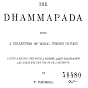

# Dhammapada latine

[](https://archive.softwareheritage.org/browse/origin/https://github.com/ETCBC/bhsa/)
[](https://zenodo.org/badge/latestdoi/104559294)
[](https://www.repostatus.org/#wip)

[](http://www.etcbc.nl)

[](https://dans.knaw.nl/en)
[](https://annotation.github.io/text-fabric/tf)


## About

This is the
[text-fabric](https://github.com/annotation/text-fabric)
representation of the Dhammapada in the edition with Latin translation by V. Fausböll, 1900.

See [about](docs/about.md) for more information about this textual source.

The conversion to Text-Fabric is joint work of 

*   [prof. dr. Bee Scherer](https://research.vu.nl/en/persons/bee-scherer),
    Text and Traditions,
    VU-University Amsterdam;
*   [prof. dr. Willem van Peursen](https://research.vu.nl/en/persons/willem-van-peursen),
    [ETCBC](http://www.etcbc.nl),
    VU-University Amsterdam;
*   Yvonne Mataar,
    transcription and correction
*   [dr. Dirk Roorda](https://pure.knaw.nl/portal/en/persons/dirk-roorda),
    [DANS](https://www.dans.knaw.nl),
    conversion to the Text-Fabric-sphere.

There is more information on the
[transcription](docs/transcription.md).

## How to use

This data can be processed by 
[Text-Fabric](https://annotation.github.io/text-fabric/tf).

Text-Fabric will automatically download the corpus data.

After installing Text-Fabric, you can start the Text-Fabric browser by this command

```sh
text-fabric dhammapada
```

Alternatively, you can work in a Jupyter notebook and say

```python
from tf.app import use

A = use('dhammapada')
```

In both cases the data is downloaded and ends up in your home directory,
under `text-fabric-data`.

See also 
[start](https://nbviewer.jupyter.org/github/annotation/tutorials/blob/master/dhammapada/start.ipynb)
and
[search](https://nbviewer.jupyter.org/github/annotation/tutorials/blob/master/dhammapada/search.ipynb).

# Author

[Dirk Roorda](https://github.com/dirkroorda)
