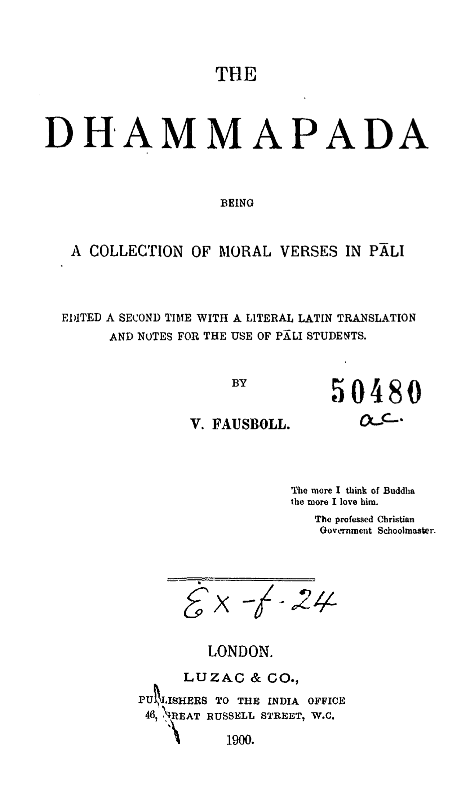
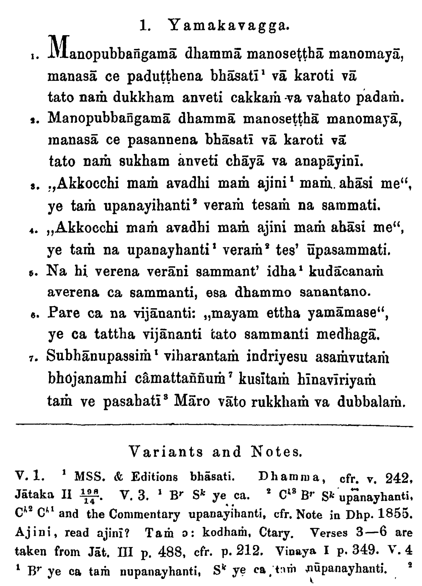
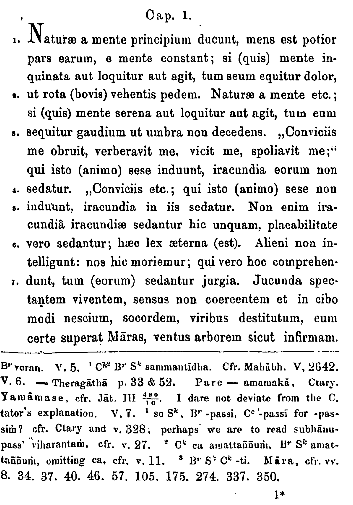

# About the Dhammapada

The Dhammapada is a collection of sayings of the Buddha in verse form
and one of the most widely read and best known Buddhist scriptures.
The first written source dates from 300 BCE.

It is written in the Pāli language, which is a close relative of Sanskrit.

## Additional resources

*   [wikipedia Dhammapada](https://en.wikipedia.org/wiki/Dhammapada)
*   [wikipedia Pāli](https://en.wikipedia.org/wiki/Pali), ISO-codes `pli`, `pi`
*   [Pāli-English with comments, by stanza](https://www.tipitaka.net/tipitaka/dhp/)
*   [Interlinear Pāli-English (single PDF)](https://www.ancient-buddhist-texts.net/Texts-and-Translations/Dhammapada/Dhammapada.pdf)
*   [English translation online](http://www.buddhanet.net/e-learning/buddhism/dhamma.htm)
*   [English translation (single PDF)](http://www.buddhanet.net/pdf_file/scrndhamma.pdf)

# About this text

The text that is the source of this dataset rests on the work of
[Viggo Fausböll](https://en.wikipedia.org/wiki/Viggo_Fausböll) who translated the
Dhammapada into Latin in 1855.
We took the text from the 1900 edition of his book in which he included the
original Pāli text in Latin script.

field | value
--- | ---
title | `The Dhammapada`
subtitle | `being a collection of moral verses in Pāli`
remark | `edited a second time with a literal latin translation and notes for the use of Pāli students`
editor | `V. Fausboll`
publisher | `Luzac & Co., Publishers to the India Office`
publisher address | `46, Great Russell Street, W.C. London`
published | `1900`

The cover page of that edition is:

# The text

The Dhammapada is divided in *vaggas* which are divided in *stanzas*.
There are 26 vaggas and 423 stanzas, which are numbered consecutively throughout the whole
work.

As an example, here are the first 7 stanzas of the first vagga in Pāli:

and here the same stanzas in Latin:

## Additional resources

*   Fausbøll, Michael Viggo, The Dhammapada. Being a collection of moral verses in Pali.
    Edited a second time with a literal Latin translation and notes
    for the use of Pali students.
    [free fragment of an article by Burkhard Scherer (PDF)](https://link.springer.com/article/10.1023/A:1012252226747)

# The conversion

The conversion program in in [tfFromTxt.py](../programs/tfFromTxt.py).
It can be seen in action in a Jupyter notebook: 
[convert.ipynb](https://nbviewer.org/github/etcbc/dhammapada/blob/master/programs/convert.ipynb)

# Progress

*   **2021-12-24** First version. The text-fabric features correspond to the plain texts and
    the obvious structure in vaggas, stanzas, sentences, and clauses.
    No attempts to add linguistic features have been made so far.

# Future work

We can use the current dataset to generate workflows to annotate the texts
with linguistic features, such as lemma, part-of-speech, etc.
