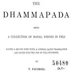

# Feature documentation

Here you find a description of the transcriptions of the Dhammapada,
the
[Text-Fabric model](https://annotation.github.io/text-fabric/tf/about/datamodel.html)
in general, and the node types, features of the
Dhammapada corpus in particular.

See also

*   [about](about.md) for the provenance of the data;
*   [TF docs](https://annotation.github.io/text-fabric/tf) for documentation on Text-Fabric.

## Transcription

The corpus consists of a text in Pāli and a Latin translation of the text.
The main subdivision is in 26 units named *vaggas*, which are themselves divided
into stanzas. There are 423 stanzas in the whole work and they are numbered across the vaggas
from 1 to 423. These numbers are coded in the feature `n`.

The original text and its translation are linked stanza-wise.

During conversion we have made a finer division in clauses and sentences.
Sentences are terminated by `.` and `?`, clauses are terminated by `;`, `:`, and
also by `-` when it is not attached to a word.

Clauses are subdivided in words, and words consist of
non-letters before, letters, and non-letters after.

Sentence and clauses sometimes cross stanza boundaries boundaries, but never
vagga boundaries.
That is why we number sentences and clauses by their sequence number within their
vaggas, again in feature `n`.

Most words are separated by spaces, but we also make word divisions in strings like
`(qui-)que`.

In the Latin text we encounter `( )`: this is material added for clarity by author
of the translation, Fausbøll. We code it in the feature `clarity`, see below.

In the Pāli text we also encounter `[ ]`: this is material that is not completely certain.
We code it in the feature `uncertain`, see below.

In both text there is quoted material. We normalize the quotes to the ASCII double quote
`"`, and we mark words in a quotation by means of the feature `quote`.

There is (very little) material outside stanzas: one case of interstanza material,
and several cases at the start and end of vaggas.
We mark this material with the feature `extrastanza`.
The stanza number for extra stanza material is the stanza number of the nearest stanza in the
same vagga, increased by 1000. So a 4-digit stanza number is by definition not a real stanza.
And a 3-digit stanza is always a real stanza.

Sentences, clauses and words either belong to the Pāli original or to the Latin
translation. The feature `trans` codes which is the case.

**Mind the twins**

The fact that stanzas contain both the original and the translation has these consequences:

*   If you count the words inside a stanza, you add up the Pāli words and the
    Latin words. Likewise if you count sentences and clauses.
*   If you want to count only words, clauses, sentences of one text type,
    use the `trans` feature to distinguish between them.
*   If you count the words *within* sentences or clauses, you count the words of
    one text type only.


## Text-Fabric model

The Text-Fabric model views the text as a series of atomic units, called
*slots*. In this corpus [*words*](#word) are the slots.

On top of that, more complex textual objects can be represented as *nodes*. In
this corpus we have node types for:

[*word*](#word),
[*clause*](#clause),
[*sentence*](#sentence),
[*stanza*](#stanza),
[*vagga*](#vagga),

The type of every node is given by the feature
[**otype**](https://annotation.github.io/text-fabric/tf/cheatsheet.html#f-node-features).
Every node is linked to a subset of slots by
[**oslots**](https://annotation.github.io/text-fabric/tf/cheatsheet.html#special-edge-feature-oslots).

Nodes can be annotated with features.
Relations between nodes can be annotated with edge features.
See the table below.

Text-Fabric supports up to three customizable section levels.
In this corpus we use only two:
[*vagga*](#vagga) and [*stanza*](#stanza).

# Reference table of features

*(Keep this under your pillow)*

## *absent*

When we say that a feature is *absent* for a node, we mean that the node has no value
for the feature. For example, if the feature `trans` is absent for node `n`, then
`F.trans.v(n)` results in the Python value `None`, not the string `'None'`.

In queries, you can test for absence by means of `#`:

```
word trans#
```

gives all lines where the feature `trans` is absent (these are all the Pāli words).

See also
[search templates](https://annotation.github.io/text-fabric/tf/about/searchusage.html)
under **Value specifications**.

## Node type [*word*](#word)

Basic unit containing a word plus attached non-word stuff such as punctuation,
or a text-critical sign like `( ) [ ]`.

feature | values | description
------- | ------ | ------
**pali** | `manasā` | the real word letters of a Pāli word
**latin** | `mente` | the real word letters of a Latin word
**palipre** | `[` | immediately preceding non-word characters of a Pāli word
**latinpre** | `[` | immediately preceding non-word characters of a Latin word
**palipost** | `[` | non-word characters after of a Pāli word, including whitespace
**latinpost** | `[` | non-word characters after of a Latin wor, including whitespaced
**extrastanza** | `1` | indicates the word is outside a stanza
**quote** | `1` | indicates the word is inside a quotation
**uncertain** | `1` | **Pāli only**: indicates the word is uncertain (somewhere inside a `[ ]` pair
**clarity** | `1` | **Latin only**: indicates the word is added for clarity (somewhere inside a `( )` pair
**trans** | `1` | indicates the word belongs to the Latin translation

## Node type [*clause*](#clause)

Subdivision of a containing [*sentence*](#sentence).

feature | values | description
------- | ------ | ------
**n** | `1` `2` | sequence number of a clause within its vagga
**trans** | `1` | indicates the clause belongs to the Latin translation

## Node type [*sentence*](#sentence)

Subdivision of a containing [*vagga*](#vagga).

feature | values | description
------- | ------ | ------
**n** | `1` `2` | sequence number of a sentence within its vagga
**trans** | `1` | indicates the sentence belongs to the Latin translation

## Node type [*stanza*](#stanza)

Section level 2.

Subdivision of a containing [*vagga*](#vagga).

feature | values | description
------- | ------ | ------
**n** | `1` `2` | sequence number of a stanza within the whole work

## Node type [*vagga*](#vagga)

Section level 1.

Subdivision of the whole work.

feature | values | description
------- | ------ | ------
**n** | `1` `2` | sequence number of a vagga within the whole work

# Text formats

The following text formats are defined (you can also list them with `T.formats`).

format | description
--- | ---
`text-orig-full`     | prints the text of all words, Pāli and Latin
`text-pali-full`    | prints the text of all Pāli words and leaves Latin words empty
`text-latin-full`    | prints the text of all Latin words and leaves Pāli words empty
`layout-orig-full`   | as `text-orig-full` but with special layout for quote, uncertain, clarity, etc.
`layout-pali-full`   | as `text-pali-full` but with special layout for quote, uncertain, clarity, etc.
`layout-latin-full`   | as `text-latin-full` but with special layout for quote, uncertain, clarity, etc.

The formats with `text` result in strings that are plain text, without additional formatting.

The formats with `layout` result in pieces html with css-styles;
the richness of layout enables us to code more information
in the plain representation, e.g. blurry characters when words are uncertain.
We also use different colours for Pali and Latin.
